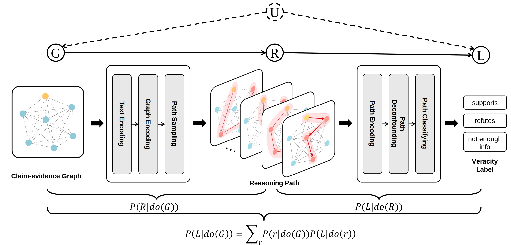

# CausalWalk
Code and data for our paper "Causal Walk: Debiasing Multi-hop Fact Verification with Front-door Adjustment" in AAAI 2024.

# Data
To further investigate the effectiveness of the proposed method on debiasing multi-hop fact verification, we extend [PolitiHop](https://github.com/copenlu/politihop) with the help of GPT-4. 

All the datasets we constructed can be found [here](https://drive.google.com/drive/folders/19IdPsf0hZCnoHVnfHIelzEmnbkU3EF_6?usp=sharing).

# Code
The code will be released soon.
